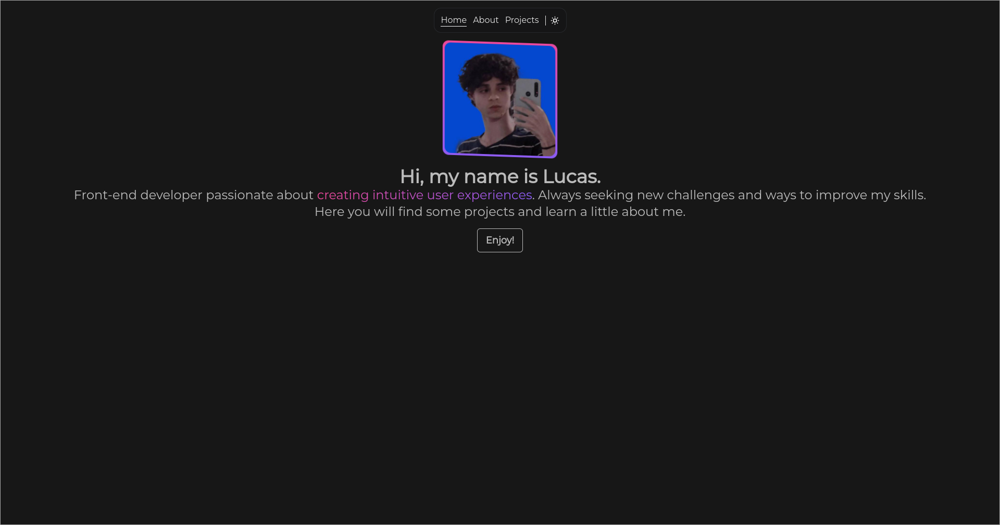

# lucas-porfolio

## Index
- <a href="#how-to-run">How To Run</a>
- <a href="#examples">Examples</a>

You can see a explication above components here:
- <a href="./docs/components.md">Components</a>

## Technologies Used
HTML, CSS, JavaScript, Vue3 (Vue Router), Tailwind CSS, NPM (Node Package Manager) and Vite.

## How To Run

### 1. Clone Repository
```sh
git clone https://github.com/lucwx/meu-portfolio.git
```

```sh
cd meu-portfolio
```

### 2. Install Dependencies

```sh
npm install
```

### 3. Run Project Locally

```sh
npm run dev
```
## Examples


<p align="center" style="font-style: italic;">Desktop Main Page on Dark Theme.</p>

<hr>


<p align="center" style="font-style: italic;">Mobile Main Page on Light Theme.</p>
